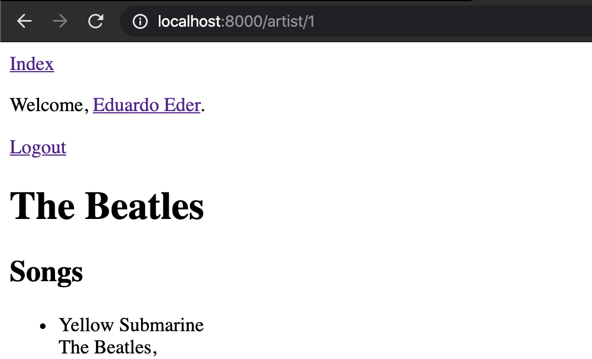
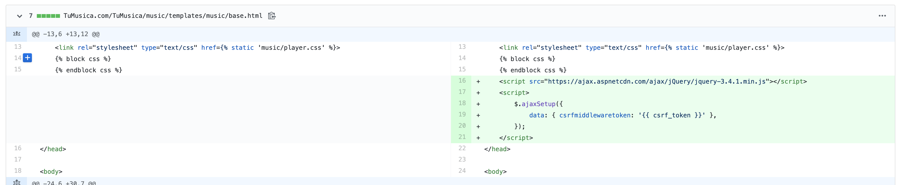
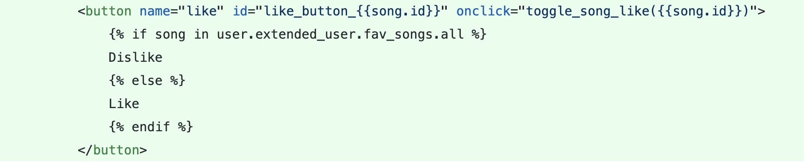
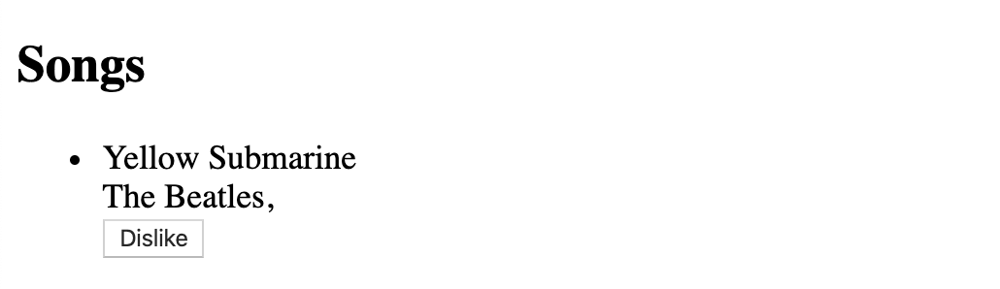

# Fav Songs y Postgresql

## Introducción

Ahora veremos como se puede extender la funcionalidad de django para agregar canciones favoritas por usuario y mostrarlas en su perfil, además de ver la página de cada artista.
Además veremos los fácil que es conectarnos a una base de datos en Postgresql.

## Artist View y Template

En nuestro primer commit crearemos el view para visualizar el template de un artista en específico. Notemos que tenemos un nuevo argumento id que recibimos en nuestra función get. En el siguiente commit veremos como insertamos ese id en la url.
Además, también veamos la función get_object_or_404. Este shortcut es muy útil ya que si no encuentrar el objeto que se busca regresa directamente un código 404 NOT FOUND.
Para más información sobre get_object_or_404 <https://docs.djangoproject.com/en/3.0/topics/http/shortcuts/#get-object-or-404>

Commit: <https://github.com/EderVs/IS-laboratorio-2020-2/commit/2d55f59e491df0412fdaa359e68368cdfbd5f640>

Creamos nuestro template y además veamos lo que sucede en los urls. Se agrega \<int:id\> en la urls para recibir el parámetro que se quiera. Como es de esperarse se puede recibir otro tipo de parámetros (strings por ejemplo) y también se le puede poder el nombre de variable que se quiera (En este caso tiene el nombre de id. Este es el que está en el view). Así ya podemos acceder a página de un artista por su id.

Además de lo anterior cambié el nombre de las vistas para evitar tener el mismo nombre que los modelos :sweat_smile:.

Commit: <https://github.com/EderVs/IS-laboratorio-2020-2/commit/efccf32ae63df2a16ee9f8b8520ba304b790ec18>

Y ahora sí ya mostramos los enlaces a las páginas de todos los artistas en el index.

Commit: <https://github.com/EderVs/IS-laboratorio-2020-2/commit/9e6d746da5781a63405a879ea5bb87ee2125a1f5>

## ExtendedUser

Para poder agregar los atributos que sean necesarios para el usuario (además de los que ya tiene el User de Django) se puede crear un ExtendedUser que "extienda" al usuario de Django. Veasé que tiene una relación uno-a-uno con un Usuario de Django. En este nuevo modelo agregamos las canciones favoritas que queremos guardar para cada usuario.

Además creé un template separado parar mostrar las canciones y tratar de evitar repetir código.

Commit: <https://github.com/EderVs/IS-laboratorio-2020-2/commit/1fc8f0d1a2171c933c36dbb5066a59532d23ddf3>

## Fav songs

Aquí viene lo bueno. En este commit se hicieron varias cosas para que el funcionamiento de dar "like" a una canción esté "completo".

Lo primero que hice fue cambiar los modelos para agregar los related_name (para quien no los recuerde <https://stackoverflow.com/questions/2642613/what-is-related-name-used-for-in-django>) correctos para poder acceder a extended_user desde un usuario de django. También agregué ExtendeddUser al admin de django.

Para las fav songs, del lado del backend, creé una vista que recibe el id de una canción y hace un "toggle" entre like y dislike del usuario que está loggeado (agrega o elimina la canción de sus fav_songs). Esta vista es muy simple y simula cómo funciona un simple endpoint de api en Django. Existen herramientas para mejorar el desarrollo de una api en Django como [Django Rest Framework](https://www.django-rest-framework.org/). Este es tan simple que regresa un string con lo que se tiene se tiene que poner en el html. Notemos también que se agregó **LoginRequiredMixin** como clase que hereda la vista. Esta Clase es un **Mixin** de Django. Los **Mixins** son clases que tienen un comportamiento muy parecido que un decorador, con la diferencia de que un decorador modifica el comportamiento de una función y un Mixin modifica el comportamiento de una clase. En partícular,  **LoginRequiredMixin** verifica que algún usuario está loggeado y si no lo está entonces lo manda a la página del login en lugar de seguir con la vista.

La url es parecida que la de la página de un artista.

Para el frontend lo que hice fue agregar un botón de like y dislike para que cuando se presione se mande una petición mediante ajax al endpoint/view que realizamos y ponemos dentro del botón lo que nos regresa la vista. Esto lo hice para evitar recargar la página y que la llamada http se haga de forma asíncrona (spoiler alert! Se puede hacer algo parecido para reproducir canciones.)

Es importante ver que agregué JQuery y el csrf_token a todas las peticiones que manda Ajax (recuerden que este token es necesario para verificar al usuario y para ver que no se están haciendo llamadas desde otro lado.) para que estas se puedan hacer con éxito.

También no hay que pasar por desapercibido que se puso un id distinto para cada botón para que se pueda identificar de manera única.

Y así se ve de manera gráfica

Commit: <https://github.com/EderVs/IS-laboratorio-2020-2/commit/8123567bd30f58bcc48f37442fa76fa477a44dec>

## Profile

Olvidé crear el ExtendedUser desde el sign up entonces en este commit se hace.
Además también cambié los archivos css dentro una carpeta css para máas orden.

Commit: <https://github.com/EderVs/IS-laboratorio-2020-2/commit/8c6afaa6e61b92c48cfff9a6bbdd282cc1a180ce>

Se agrega el template del perfil del usuario que está loggeado y este sólo puede ser ingresado por un usuario loggeado (Se vuelve a utilizar el LoginRequiredMixin).

También se cambia la url LOGIN_URL (dentro e settings.py) para que cuando un usuario que no esté loggeado quiera ingresar a su perfil le mande a la página correcta de login.

Commit: <https://github.com/EderVs/IS-laboratorio-2020-2/commit/9eb35ee7598bdfcf6d78a0f2cd705fbd51d5764de>

## Postgresql

Utilizar una base de datos de Postgresql con Django es muy sencillo. Sólo se necesita tener las claves de acceso correctas y cambiar la configuración en settings.py. Les recomiendo ver este [artículo](https://djangocentral.com/using-postgresql-with-django/) para más información. En mi caso, yo guardé las claves en mis variables de entorno (depende como crearlas de acuerdo a su entorno virtual. Si utilizan conda: <https://docs.conda.io/projects/conda/en/latest/user-guide/tasks/manage-environments.html#saving-environment-variables>).

Y para terminar sólo agregué una valiación de que sólo se muestre el botón de like/dislike si es que está loggeado.

Commit: <https://github.com/EderVs/IS-laboratorio-2020-2/commit/b20f459a8dea198c90c3e1a6a7093dda37a5b2b1>

¡Y ya!

Recursos:

- Mixins: <https://www.google.com/search?q=django+mixins&oq=django+mixins&aqs=chrome..69i57j69i64.2891j0j7&sourceid=chrome&ie=UTF-8>
- Ajax en JQuery: <https://api.jquery.com/jquery.ajax/>
- Parámetros de url y get_object_of_404: <https://docs.djangoproject.com/en/3.0/intro/tutorial03/>
- Postgresql en Django: <https://djangocentral.com/using-postgresql-with-django/>