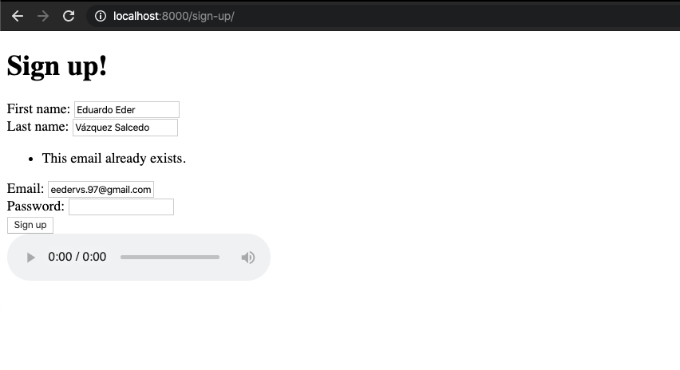

# Forms y Aunthentication

## Introducción

Todas las páginas web y programas tienen formularios en los cuales se introducen datos para ser guardados, actualizados, buscados o borrados.
La forma en que se hace en las páginas Web es mediante la etiqueta `<form>` en html. Ahora veremos como podemos manejar los formularios del lado de django además de crear y logear (perdón por mi spanglish) usuarios.

Haré referencias a commits por lo que les recomiendo que vean todos los cambios en cada commit para que sigan el hilo.

## Users App

Lo primero que haremos será crear una app para hacer toda la gestión relacionada a los usuarios de nuestro proyecto de Django.
No olviden agregar su app a las **INSTALLED_APPS**
En el primer commit cree la app llamada **users**.

Commit: <https://github.com/EderVs/IS-laboratorio-2020-2/commit/9e63f7c6cd825a7c74005a78878f4d0a641ada96>

## Sign Up

Ahora haremos todo mínimo necesario para que un usuario se registre.
Por el momento no crearemos un modelo extra para usuarios ya que Django nos prove de ya un modelo de usuarios (`User`). Pueden encontrar más información aquí:

<https://docs.djangoproject.com/en/3.0/ref/contrib/auth/#django.contrib.auth.models.User>.

Primero creamos un template y una view para ahí agregar nuestro formulario de **Sign Up**.

Commit: <https://github.com/EderVs/IS-laboratorio-2020-2/commit/4ce17d0ca8bb798888d7021d0f6b3011c4774d8e>

Creamos un **Form**. Un **Form** es una clase en Django (muy parecida a un modelo) en la que nosotros podemos validar cada uno de los campos dentro de algún form. Los campos se representan como atributos de la clase. Nosotros crearemos un **SignUpForm** con los campos de first_name, last_name, email y password (Para este último vean los siguiente commits ya que me equivoque en este :sweat:).

Commit: <https://github.com/EderVs/IS-laboratorio-2020-2/commit/5c2207b4f5d5dc9c8bb2d0eb40299d92c1ec74b0>

Agregamos el formulario a nuestro template mediante al etiqueta `<form>`, como fue mencionado arriba. Para la etiqueta `<form>` deben de agregar el `method` (éste es el método http que ejecutará).

Commit: <https://github.com/EderVs/IS-laboratorio-2020-2/commit/4a8ec819b2635b7ae1b48132715ff07eff6e9cf6>

Tal como lo tenemos no funcionará ya que Django tiene seguridad para que no puedas mandar un form desde cualquier lado. Para eso debemos de agregar la etiqueta `` que genera un token que sirve como contraseña de que el form enviado es seguro.

Commit: <https://github.com/EderVs/IS-laboratorio-2020-2/commit/5ba3566a6f97304952b65c45c0588ea4a47ca323>

Ahora validaremos que la información enviada es correcta. En este caso validaremos que efectivamente nos envían un correo, un char field, etc. Esto se hace con el método is_valid del Form. Esto es lo valioso de utilizar forms, que ya no hace este tipo de validaciones en automático. Aquí ya puse bien el Password.

Commit: <https://github.com/EderVs/IS-laboratorio-2020-2/commit/9205054853fd13a9f9eb82e1469628df1c6ae511>

Además de las validaciones, un Form también tiene un mecanismo para que evitemos escribir todo el form en el template. Con tan sólo agregarlo al context y ponerlo en el template, ya tenemos todo mínimo necesario para tener un los campos dentro del form :raised_hands:.

Commit: <https://github.com/EderVs/IS-laboratorio-2020-2/commit/38f530e09eb8dcf3d8d562e738baa2ab66e0f0a1>

También lo podemos hacer manejable para que nosotros podamos agregar las etiquetas que queramos:

Commit: <https://github.com/EderVs/IS-laboratorio-2020-2/commit/d557196a205d3f540504f21adda194ff5450f236>

Ahora sí ya creamos el usuario con la información que nos muestren en el form. Con `cleaned_data` (es un dict) podemos obtener los datos ya "limpiados" (Ya que puede que nosotros podemos validarlos y limpiarnos como queramos) que nos envían. Noten que hacemos trampa y ponemos como username el email que nos mandan.

Commit: <https://github.com/EderVs/IS-laboratorio-2020-2/commit/8f62fd7d7cc2a00ace9f2d0f4922cccf48347c54>

Pero tenemos un problema. Si nosotros agregamos un email que ya existe, como la base tiene un constrain de que debe de ser único, nos mandará este feo error:


Por lo que al momento de crear el usuario tenemos que validar si ya existe. Esto lo hacemos mediante el método `clean_<field_name>` para validar un campo en específico. Nosotros queremos validar el campo email por lo que crearemos `clean_email` para verificar que no haya un email así en la DB. Entonces en el momento en el que mandamos a llamar `is_valid` en la vista se ejecuta esa validación y lo podemos ver en el template.



Commit: <https://github.com/EderVs/IS-laboratorio-2020-2/commit/7fb582e4c9a21a68ad05f7ff2c7a18c9f723b458>

Ahora agregamos un link al Index en base.html para que todos los templates lo tengan. Noten que agregué `app_name` en las urls para facilitar obtener un link mediante el tag ``. En este caso ``

Commit: <https://github.com/EderVs/IS-laboratorio-2020-2/commit/50ba3419be193ab1de01dd09c3dccb2e9faa95d3>

Y ya tenemos listo nuestro Sign Up.

## Login

Para el login la estructura es parecida sólo que ahora aprovecharemos que Django ya tiene un Form para Login que se llama **AuthenticationForm**. Creamos un **LoginForm** que hereda de **AuthenticationForm**. **AuthenticatioForm** ya tiene los atributos username y password necesarios para un login.

Pero nosotros queremos extender su validación para decir si el email que se ingreso fue incorrecto o si la contraseña fue la incorrecta. Para esto sobreescribimos el método `clean`, ahí agregaremos buscaremos el email que fue ingresado y si existe, verificar que la contraseña es correcta. Recuerden que Django guarda las contraseñas hasheadas con la SECRET_KEY (Que se encuentra en settigs.py) por lo que tenemos que utilizar el método authenticate para que nos haga este proceso de hasheo.
Nótese que ahora no levantamos un ValidationError cuando encontramos un error, si no que ahora agregamos el Validation error al campo que le pertenese para que se muestre correctamente.

Ya que se validaron los datos, hacemos el login en la vista mediante la función `login` que django ya tiene. Se debe de enviar el request y el usuario que se loggeará.

Commit: <https://github.com/EderVs/IS-laboratorio-2020-2/commit/6a5fcd62bac4ec9f6bbc33182f6cca0aea20f3f1>

## Logout

Ya para terminar agregamos un logout para los usuarios loggeados.
Para esto creamos una vista que sólo tenga un get que haga el logout.
Éste se hace mediante la función `logout` de Django.
En los templates podemos verificar si un usuarios está loggeado mediante:

```html

<p>Welcome, {{ user.first_name }}.</p>
<a href="">Logout</a>

<a href="">Login</a> or <a href="">Sign Up</a>

```

La variable `user` siempre está en el contexto de cualquier template.

Commit: <https://github.com/EderVs/IS-laboratorio-2020-2/commit/f9bd826bd8ca674186ef23dd48f3a08b53b5be3a>

¡Y ya!

Recursos:

- Forms: <https://docs.djangoproject.com/en/3.0/topics/forms/>
- User: <https://docs.djangoproject.com/en/3.0/ref/contrib/auth/#django.contrib.auth.models.User>
- Form validation: <https://docs.djangoproject.com/en/3.0/ref/forms/validation/#raising-validation-error>
- Authentication in templates: <https://docs.djangoproject.com/en/3.0/topics/auth/default/#authentication-data-in-templates>
